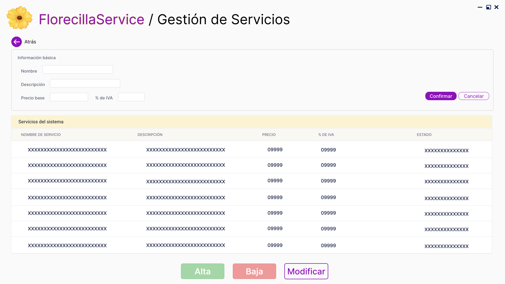

# Trabajo en equipo
Para la planificación y ejecución de esta primera iteración, el equipo distribuyó las responsabilidades de la siguiente manera: 
* Ernst Milagros Shaiel: Desarrollo de las historias de usuario relacionadas con la gestión de Servicios
* Menacho Natalia Agustina: Desarrollo de las historias de usuario relacionadas con la Facturación Masiva, Facturación individual y Anulación de factura
* Roko María Guillermina: Creación de Pantallas y Frontend
* Verón Juan Manuel: Desarrollo de las historias de usuario relacionadas con la gestión de Clientes

# Diseño Orientado a Objetos
Para el desarrollo del diagrama de clases trabajamos en la página Draw.io. El link del mismo está dentro de /diagramas/links.

### Diagrama de Clases

El mismo cuenta con las clases Cuenta, Cliente, Administrador, Factura, Detalle_Factura, Servicio, NotaCredito, DetalleNota y Pago.
Además de enumeradores como, EstadoServicio, EstadoCuenta, CondicionIVA, EstadoFactura, MetodoPago, TipoDocumento, TipoComprobante

# Wireframe y Casos de uso
Los diseños se utilizan de la siguiente manera:
### Pantalla de inicio

En esta pantalla de inicio se divide en tres partes. La primera sección, donde se encuentra el nombre del sistema. La sección del medio la cual posee tres botones: **Clientes**, que lleva a la pantalla para gestionar clientes, **Servicios**, que lleva a la pantalla para gestionar servicios, y finalmente el botón **Facturación**, el cual lo redirige a la pantalla para gestionar las facturaciones del sistema. 
En la última sección, se muestra la información académica y el grupo que presenta este trabajo.

### Pantalla de Gestión de Clientes

Esta pantalla funciona para gestionar clientes del sistema. Nuevamente se divide en 3 secciones. En la primer sección se encuentra un formulario con campos bloqueados para la información personal de un cliente, esta sección se habilita en el momento que decida dar de alta a un nuevo cliente. Hay dos botones alineados a la derecha; **Confirmar** confirma los datos ingresados y finaliza con éxito el alta del nuevo cliente, **Cancelar** cancela el alta de un nuevo cliente. En la segunda sección, se encuentra una tabla con todos los clientes registrados en el sistema. Observe que en cada fila se encuentra un botón de acción denominado **"ver mas detalles"**, el cual lo redirigirá a la pantalla **Detalle de Cliente**, donde podrá modificar sus datos o asignarle servicios.
Finalmente, en la última sección, se encuentran los botones de **Alta**, **Baja** y **Modificar**. El botón de **Alta** habilita los campos de la primer sección, para que pueda cargar los datos de un nuevo usuario. El botón **Baja** se habilita en el momento que se seleccione un cliente de la tabla y lo da de baja. De igual manera, el botón **Modificar** se habilita al momento de seleccionar un cliente de la tabla y lo redirige a la pantalla **Detalle de Cliente** para continuar con la modificación.

### Pantalla de Gestión de Clientes - Detalle de Cliente

Esta pantalla sirve para observar los detalles del cliente, modificarlo y asignarle servicios. Es muy similar a la pantalla anterior, solo que ésta muestra con más detalle la información de un cliente en específico. En la esquina izquierda se tiene un botón de navegación **Atrás** que nos lleva a la pantalla anterior. En la parte superior observamos los campos rellenados con la información personal del cliente elegido. Debajo, hay una tabla que muestra todos los servicios contratados por este cliente. Tenemos una columna de acción que permite ver las facturas del servico y otro que permite la baja del servicio a este cliente. Asimismo, debajo de esta tabla vemos un botón **Asignar Servicios**, el cual lo redirige a la pantalla de asignación de servicios a clientes. 
Luego de esta tabla sigue el flujo normal de la pantalla, vemos la misma tabla de clientes para la gestión de servicios y debajo los botones de **Alta**, **Baja** y **Modificacion**, aunque, el botón de alta permanece bloqueado. Desde esta pantalla podemos dar de baja al cliente o modificarlo. 

### Pantalla de Gestión de Clientes - Asignar Servicio

Esta pantalla permite la asignación de servicios a un cliente. En la parte superior izquierda de la pantalla observamos el botón de navegación **Atrás** que nos lleva a la pantalla anterior. Debajo observamos la información personal del cliente al cual vamos a asignar los servicios. Debajo Observamos dos tablas, primero la tabla de **Servicios contratados**, la cual muestra todos los servicios que el cliente tiene contrados. Observe que es la misma tabla que tenia en la pantalla de detalle anterior. Luego le sigue la tabla de **Servicios del sistema**, esta tabla lista todos los servicios que tiene el sistema y que el cliente no ha contratado aún. Esta tabla muestra el nombre, descripción, precio y % de iva del servicio. En la columna de acciones, tiene el botón **Asignar servicio** para asignarlo, y otro **Gestionar Servicio** que lo redirige a la pantalla de **Gestionar Servicios**

### Pantalla de Gestión de Servicios

La pantalla de **Gestión de Servicios** funciona de manera similar a la pantalla de Gestión de Clientes. Note que el flujo de trabajo es el mismo. En la primer sección se observan campos bloqueados, en la segunda una tabla con todos los servicios del sistema registrados y finalmente los botones de **Alta**, **Baja** y **Modificar**. Funcionan de manera similar, al presionar **Alta** Se habilitan los campos que permitirán ingresar los datos de un nuevo servicio. Para concluir con la operación, debe presionar el botón **Confirmar** que se encuentra a su derecha. Si quiere descartar los cambios, presione el boton **Cancelar**. 
Al seleccionar un servicio de la tabla, se habilitan los botones **Baja** y **Modificar**. Al presionar **Baja** se dará de baja el servicio seleccionado. Al presionar **Modificar**, se habilitarán los campos de la primer sección con los datos del Servicio a modificar. De igual forma como en el **Alta**, presione **Confirmar** para confirmar los cambios o **Cancelar** para descartarlos.

### Pantalla de Facturación Masiva

(inserte descripcion)

# Backlog de iteraciones

* HU 01 - Alta Cliente
* HU 03 - Asignar servicios a clientes
* HU 04 - Alta de servicio
* HU 07 - Facturación masiva manual
* HU 08 - Facturación individual
* HU 02 - Modificar cliente
* HU 11 - Anulación de factura

# Tareas

###### **Roko María Guillermina**
Las tareas que desarrollé para llevar a cabo mi responsabilidad del proyecto fueron las siguientes. 
En una primera instancia, comencé haciendo los bocetos de las pantallas luego de que en equipo hayamos definido el diagrama de clases y las historias de usuario. 

Desarrollé los wireframes en la aplicación Web [Pixso](https://pixso.net/). La utilicé ya que estaba familiarizada con su entorno. 

A medida que desarrollaba las pantallas consultaba con algunos integrantes del equipo para recibir recomendaciones y *feedback*. 

Al tener todos los bocetos finalizados, comencé con el código. Ya tenía una breve experiencia con el uso de `HTML` y `CSS`, aunque debí hacer una investigación exhaustiva y adquirir nuevos conocimientos para lograr lo que yo quería. 

Una vez pasados los diseños a código, apliqué la lógica de `Thymeleaf` y cree el `HomeControlador` para poder controlar el flujo de las pantallas y el código. También se inforporó un poco de `JavaScript` gestionar la interactividad de las pantallas, más específicamente para habilitar/deshabilitar formularios, facilitar la capturación de datos y, además, que solicite al controlador la persistencia o modificación de los datos, permitiendo que se actualicen los datos de las tablas sin la recarga completa de la página.

###### **Ernst Milagros Shaiel**

Desarrollé las funcionalidades correspondientes a la **HU 03 – Asignar servicios a cliente** y **HU 04 – Alta de servicio**, implementando el modelo, repositorio, servicio y controlador necesarios para cada una.

Para la **HU 03**, construí toda la lógica relacionada con la gestión del vínculo *Cliente–Servicio*, incluyendo la creación del modelo con estado y fechas, consultas específicas en el repositorio y las reglas de negocio para alta, baja y reactivación. Esto permite listar servicios contratados y disponibles, excluir servicios dados de baja de la facturación y manejar altas a mitad de mes para calcular facturación proporcional. Además, investigué sobre manejo de excepciones y buenas prácticas REST para asegurar respuestas claras desde la API.

Para la **HU 04**, desarrollé el módulo completo de creación de servicios, aplicando validaciones con anotaciones como `@NotBlank`, `@NotNull` y `@PositiveOrZero`, e implementando un controlador con `@Valid` y manejo de errores mediante `BindingResult`. Esto garantiza que el formulario solo permita datos válidos y que los mensajes de error se muestren correctamente en la interfaz. Tambien un enum el cual corresponde al tipo de IVA de cada servicio.

###### **Verón Juan Manuel**
Luego de definir el diagrama de clases en conjunto con el equipo, comencé creando los dos enumeradores fundamentales para el modelado del dominio: `EstadoCuenta` y `TipoDocumento`. Estos enumeradores fueron la base para avanzar con las clases principales.

Posteriormente me centré en desarrollar las dos clases esenciales para el alta de cliente. Inicié con la clase `Cuenta`, definiendo sus atributos, métodos y comportamientos como clase base abstracta del modelo. Luego continué con la clase `Cliente`, que extiende a Cuenta y en la cual repliqué la misma estructura de definición.

Con estas clases implementadas, avancé con la creación del `ClienteServicio`, incorporando la lógica necesaria para gestionar las operaciones principales, como el alta y la modificación de clientes, la validación de datos y el manejo del identificador de la cuenta asociada.

Más adelante implementé el `ClienteRepositorio`, donde definí los métodos encargados del acceso y persistencia de datos, permitiendo almacenar, consultar y actualizar información del cliente, aprovechando también las capacidades provistas por **JpaRepository**.

Por último, desarrollé el `ClienteControlador`, encargado de exponer los **endpoints** necesarios para la interacción mediante peticiones HTTP. En el mismo integré los servicios con la capa de presentación, habilitando operaciones como registrar un nuevo cliente, obtener un cliente o realizar búsquedas por su id.
