# Trabajo en equipo
Para la planificación y ejecución de esta segunda iteración, el equipo distribuyó las responsabilidades de la siguiente manera: 
* Ernst Milagros Shaiel: Desarrollo de las historias de usuario relacionadas con la gestión de Servicios y la emisión de recibos de pago.
* Menacho Natalia Agustina: Desarrollo de las historias de usuario relacionadas con la Anulación de Facturas y el Informe de Facturación.
* Roko María Guillermina: Creación de Pantallas y Frontend
* Verón Juan Manuel: Desarrollo de las historias de usuario relacionadas con el registro de Pagos.

# Diseño Orientado a Objetos
Para el desarrollo del diagrama de clases trabajamos en la página Draw.io. El link del mismo está dentro de /diagramas/links.

### Diagrama de Clases
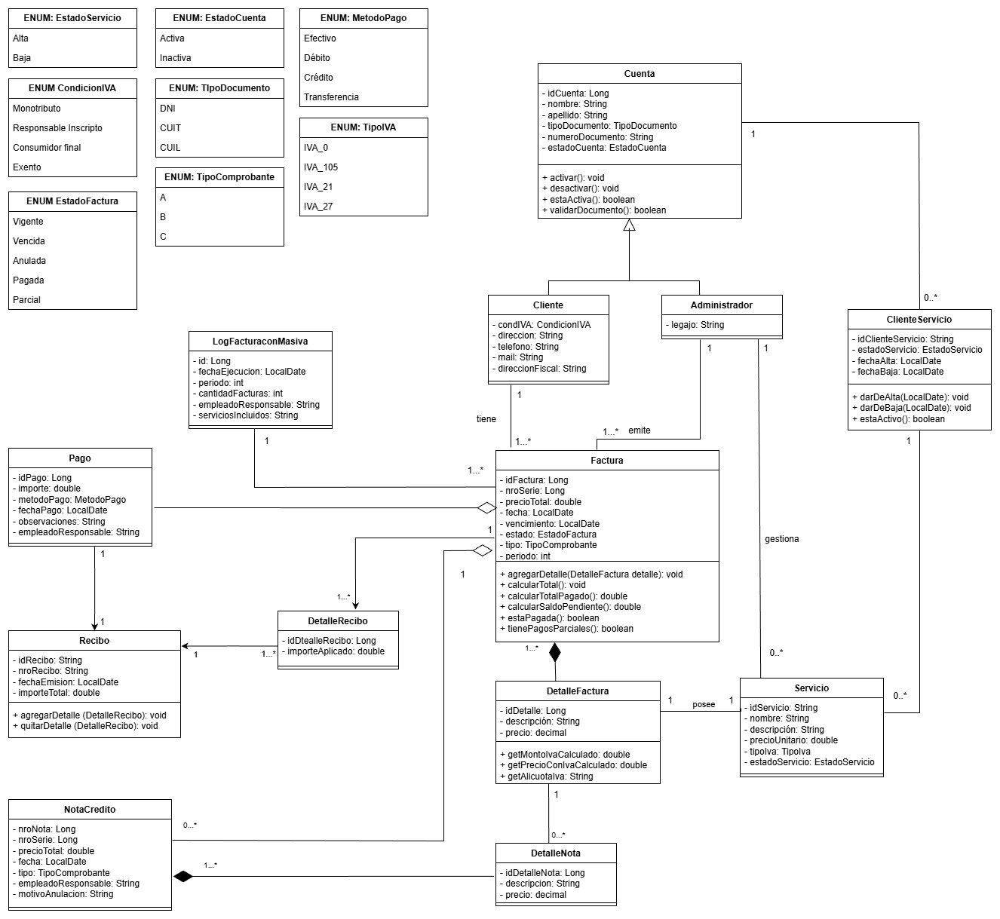

El mismo cuenta con las clases Cuenta, Cliente, Administrador, Factura, LogFacturacionMasiva, DetalleFactura, Servicio, ClienteServicio, NotaCredito, DetalleNota, Recibo, DetalleRecibo y Pago.
Además de los enumeradores EstadoServicio, EstadoCuenta, CondicionIVA, EstadoFactura, MetodoPago, TipoDocumento, TipoComprobante.

# Wireframe y Casos de uso
Los diseños de esta iteración se utilizan de la siguiente manera:
### Pantalla de Inicio
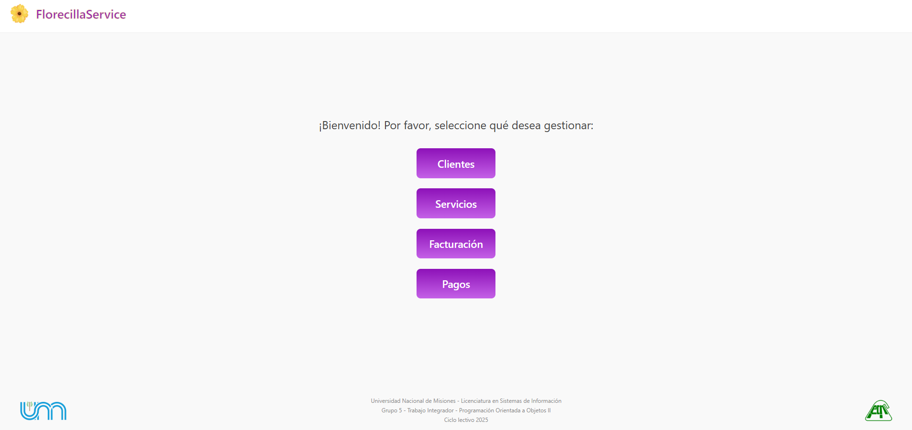

Esta es la primer pantalla que se va a encontrar al iniciar el sistema. En esta iteración se mantuvieron los mismos botones; **Clientes**, que lleva a la pantalla para gestionar clientes, **Servicios**, que lleva a la pantalla para gestionar servicios, **Facturación**, que lleva a la pantalla para gestionar la facturación y finalmente, el botón **Pagos**, el cual lo lleva a la pantalla para gestionar pagos. 

### Pantalla de Clientes-Inicio
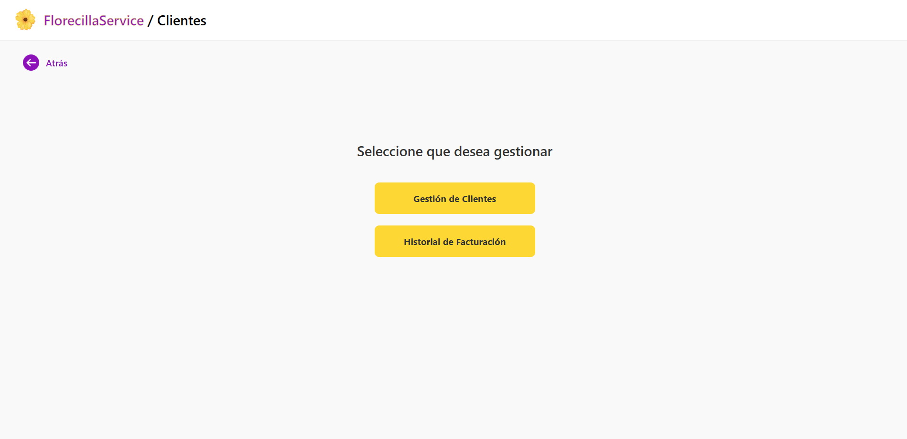

Luego de presionar el botón **Clientes**, se encontrará con esta pantalla, en donde deberá seleccionar qué quiere realizar. Por un lado, el botón para **gestión de clientes** donde podrá gestionar sus clientes, tanto darlos de alta, baja o modificar sus datos, como asignarles servicios.
El botón **Historial de facturación** lo redirige una pantalla donde, por medio de un combobox, deberá seleccionar un cliente. Luego de seleccionarlo, podrá ver su historial de facturación, como sus facturas y pagos.

### Pantalla de gestión de clientes
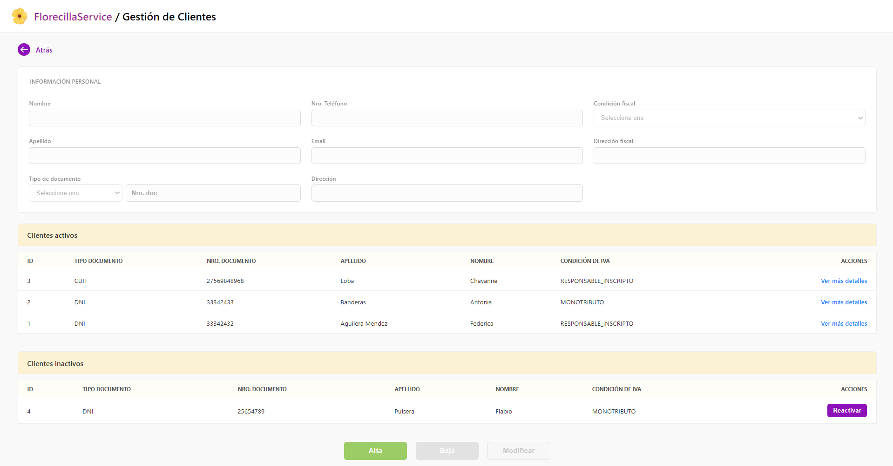

En esta pantalla usted podrá gestionar sus clientes. La pantalla se divide en tres partes. Un formulario donde ingresar datos de clientes, debajo se tienen dos tablas, una para clientes activos y otra con clientes inactivos (o dados de baja). En la tabla de clientes activos puede seleccionar el botón *'Ver mas detalles'* donde podrá visualizar los servicios asignados al cliente, con la posibilidad de asignarle servicios.

En la tabla de clientes inactivos, tendrá la posibilidad de reactivarlo por medio del botón *Reactivar*. 

Finalmente, al final se tienen tres botones; **Alta**, que habilita el formulario para ingresar los datos de un nuevo cliente, **Baja** y **Modificar**, los cuales se habilitan al momento de ingresar al detalle de un cliente específico.

### Pantalla de detalle de cliente
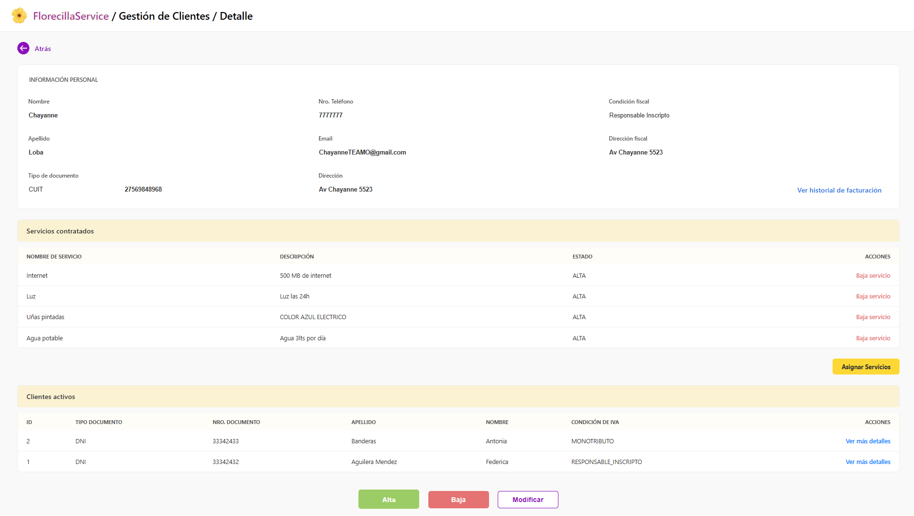

En esta pantalla se observan todos los datos del cliente seleccionado. En primera instancia se ve el formulario con sus datos cargados, junto a un botón *'Ver historial de facturación'* que lo redirige al historial de facturación de dicho cliente. Debajo se ve una tabla con los servicios contratados por el mismo, junto con un botón para asignarle servicios.
Debajo de la tabla de servicios contratados observa que continúa la tabla de clientes activos. 

Finalmente, observa los botones **Alta**, **Baja** y **Modificar**. El botón *Alta* lo redirige a la pantalla de gestión de clientes y habilita los campos para dar de alta a un nuevo cliente. El botón de *Baja* da de baja al cliente seleccionado y finalmente el botón de *Modificar* habilita los campos con los datos del cliente, para poder modificarlos. 

### Pantalla de historial de facturación
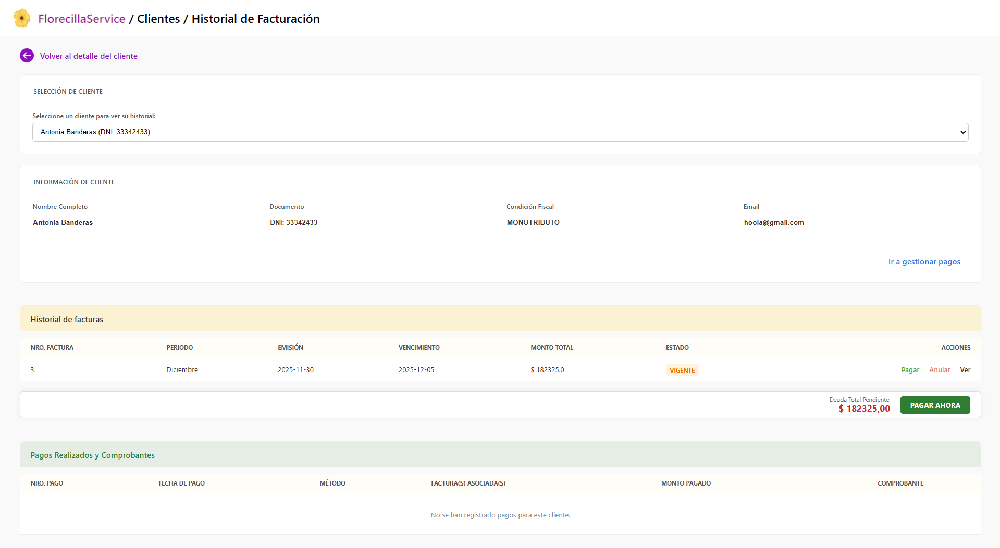

Luego de seleccionar un cliente desde el combobox, usted podrá observar el historial de facturación del mismo. Primero, se muestra la información del cliente, como *nombre completo*, *documento*, *condición fiscal* y *email*. Además de un acceso rápido a la gestión de pagos.

Debajo se observa el **Historial de facturas**, donde podrá ver el número de factura, período facturado, día de emisión, fecha de vencimiento, monto total y estado. Además cuenta con una columna **Acciones**, en donde tendrá distintas acciones dependiendo del estado de la factura.
* Si la factura tiene estado `VIGENTE`, podrá realizar las siguientes acciones:
    * *Pagar:* redirige a la gestión de pagos para pagar la factura,
    * *Anular:* anulará la factura (pidiendo obligatoriamente un motivo),
    * *Ver:* ver el detalle de la factura e imprimirla.
* Si la factura tiene estado `ANULADA`, tendrá la opción *Ver nota*, para visualizar la nota de crédito.
* Si la factura tiene estado `PAGADA`, tendrá la opción *Ver*, para ver el detalle de la factura e imprimirla.
* Si la factura tiene estado `PARCIAL`, tendrpa las opciones *Pagar* y *Ver*.

Posterior a esta tabla, y si corresponde, el sistema mostrará la deuda total pendiente junto a un botón para ir a pagar. 

Debajo de esta se encuentra una nueva tabla que muestra los pagos realizados con sus respectivos comprobantes. Donde muestra los datos del mismo junto a una columna donde podrá visualizar el comprobante e imprimirlo.

## Comprobantes
### Facturas A
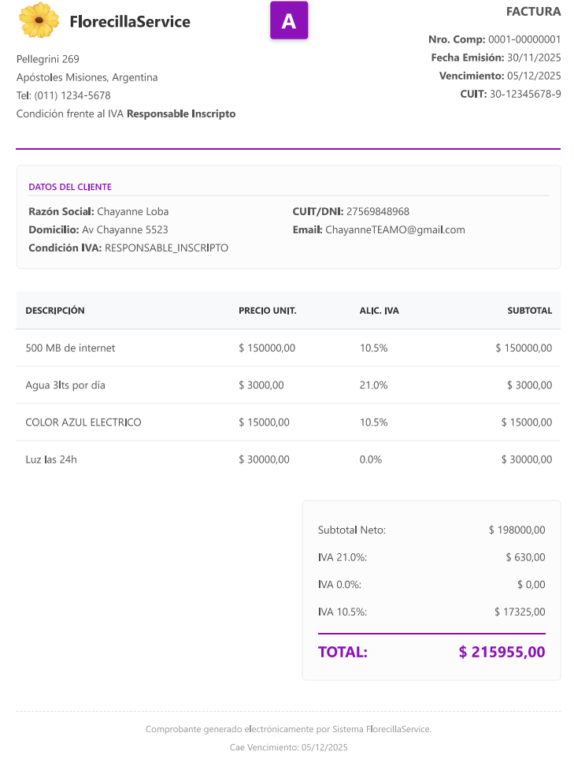

Esta es la factura N° 1 emitida para un cliente. En el encabezado, a la izquierda se observan los datos del emisor. En el centro el tipo de factura (en este caso 'A') y a la derecha los datos de la factura, como su número, fecha de emisión, vencimiento y el cuit del emisor.
Debajo se obervan los datos del cliente facturado.

En el cuerpo de la factura se observa el detalle de cada servicio facturado, con su descripción, precio unitario, alicuota de iva y el subtotal. En el pie se ve el subtotal neto junto al iva discriminado por separado y finalmente el total con su IVA discriminado. 

Si se tratase de una factura B o C, el IVA no se discrimina en la factura, se vería de esta manera: 
### Factura B
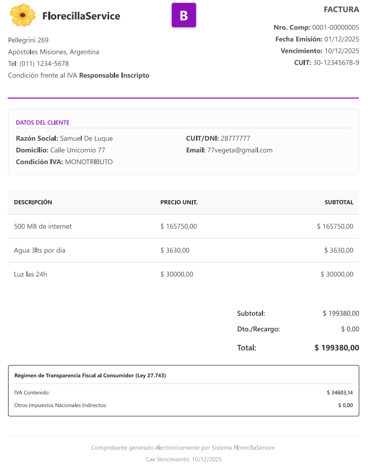

Como se observa, tiene el mismo formato, salvo que no se discrimina el IVA. Se observa la columna de descripción, precio unitario, subtotal y finalmente en el pie, el total.

### Nota de crédito
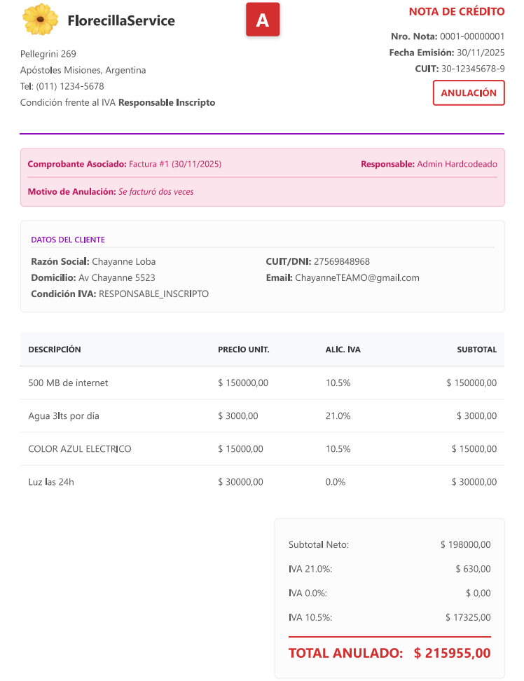

En esta imágen se observa la nota de crédito asociada a la factura A descrita anteriormente. El formato de la nota de crédito no es muy distinta a las facturas, salvo por puntos clave como, en el encabezado, antes de los datos del cliente, se indica el comprobante asociado a esta nota, junto con su fecha de emisión, el motivo de la anulación (que verá que a la hora de anular una factura, este es obligatorio) y el responsable de la anulación.

En el pie de la nota de crédito, se muestra el subtotal neto con el IVA discriminado, y finalmente el total anulado en la nota.

### Recibo de pago total
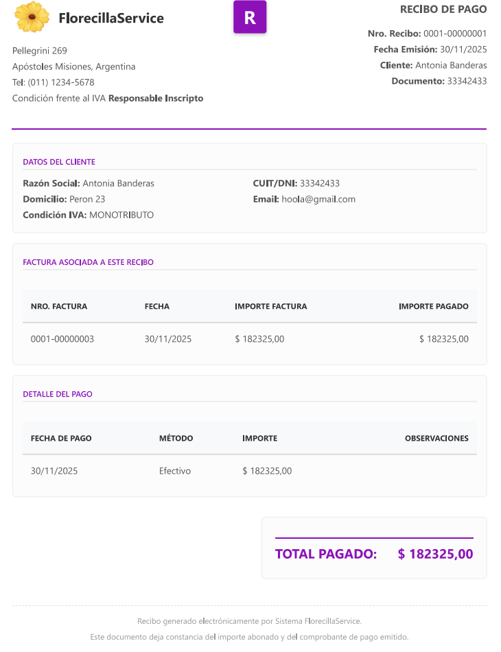

Luego de que un cliente haya realizado un pago total, se generará un recibo de pago, el cual indica la factura asociada al recibo, su número, fecha, importe y el importe pagado. 
Luego se observa el detalle del pago, en donde muestra la fecha, el método de pago y el importe nuevamente, además de una columna de observaciones opcional, que en este caso está vacía.

En el caso de pagar parcialmente una factura, el recibo se vería de esta manera:

### Recibo de pago parcial
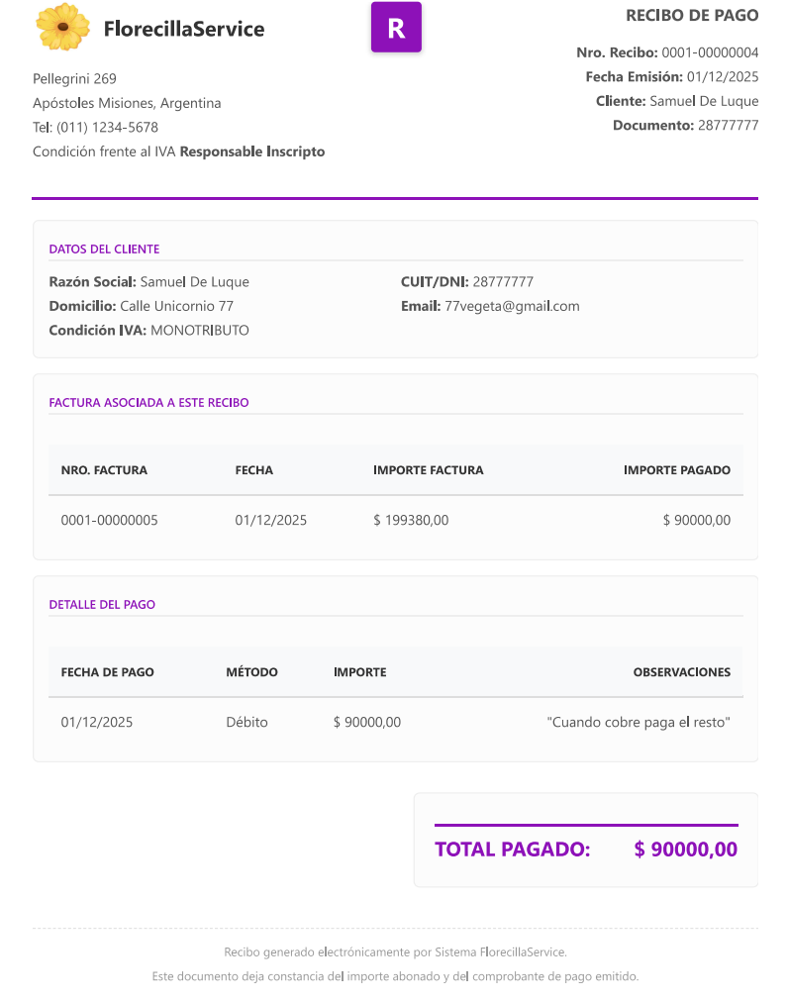

En este recibo de pago parcial, se oberva que el valor de la factura a pagar es mucho mayor que el importe pagado. En el detalle del pago muestra la fecha de pago, el método, el importe y sus observaciones. Aunque se haya generado un recibo de pago, la factura no está totalmente pagada, por lo que el estado de la factura cambia a `PARCIAL`, y tendrá asociados tantos recibos como requiera hasta que su saldo quede pagado en su totalidad.

### Facturación
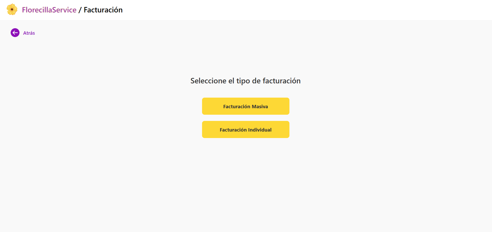

Al presionar el botón **Facturación** en el inicio, se encontrará con este pequeño menú, en donde podrá seleccionar si quiere realizar una *facturación masiva* o una *facturación individual*.

### Facturación masiva
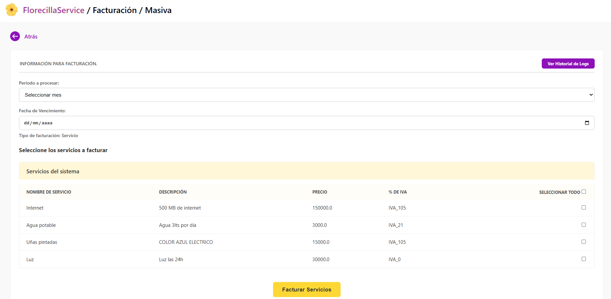

Al ingresar a la facturación masiva, se encontrará con esta pantalla. En una primera instancia verá un formulario donde seleccionará el período a facturar, junto con un `DatePicker` para seleccionar la fecha de vencimiento. 
Debajo tiene una tabla con todos los servicios dados de alta en el sistema. Para seleccionar servicios a facturar, a la derecha de la tabla se encuentra un `checkbox` por renglón, junto a uno general para seleccionar todos. Debajo de la tabla se encuentra el botón para facturar servicios.

Una nueva incorporación de esta iteración en la pantalla de facturación masiva, es la posibilidad de visualizar el `historial de logs` de la facturación masiva. El botón para acceder a ella se encuentra en la esquina superior derecha, con el nombre **"Ver historial de Logs"**. 

### Historial de Logs
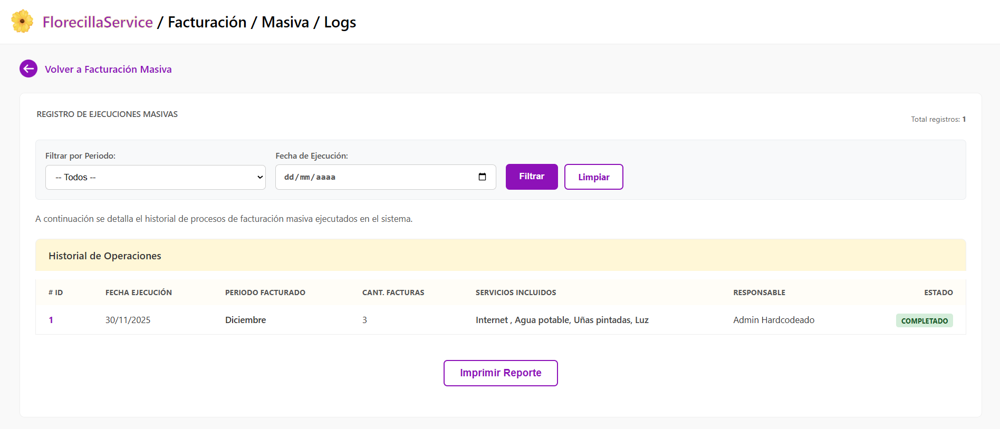

En esta pantalla se encontrará con los registros de ejecuciones masivas en el sistema. De primeras se tienen criterios de filtrado opcionales, donde permite filtrar por período y fecha de ejecución. Observe que si no selecciona ninguno, se muestran todos los logs registrados en el sistema. 
Debajo, se encuentra la tabla con el *historial de operaciones*, en donde se ve el ID de la operación, fecha de ejecución, período facturado, cantidad de facturas generadas, servicios incluídos en la facturación, el responsable de la ejecución y el estado de la misma. También tiene la posibilidad de imprimir el reporte presionando el botón **Imprimir Reporte**. 

### Facturación individual
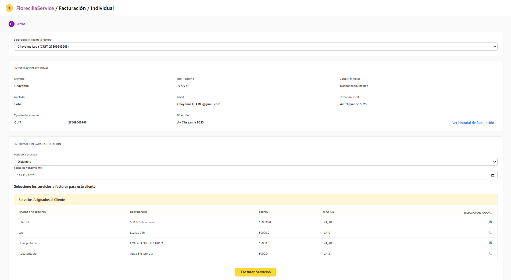

Al ingresar a la facturación individual, en primera instancia tendrá que seleccionar un cliente dentro de un `ComboBox`. Al seleccionar un cliente, el sistema le mostrará esta pantalla, donde primero se despliegan los datos del cliente, junto a un acceso directo al historial de facturación: *"Ver historial de facturación"*.

Debajo podrá seleccionar el período a facturar y la fecha de vencimiento. Y a continuación la tabla con sus servicios adquiridos para seleccionarlos por medio de un checkbox, igual que en la pantalla de facturación masiva.

### Administrar pagos 
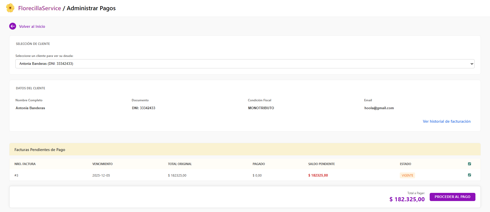

Luego de presionar el botón **"Pagos"** desde el inicio, ingresará a esta pantalla. En primera instancia tendrá que seleccionar un cliente dentro de un `ComboBox`. Al seleccionar un cliente, se desplegarán algunos de sus datos, como el *nombre completo*, *documento*, *condición fiscal* y *email*. Junto a un acceso directo al historial de facturación: *"Ver historial de facturación"*.

Debajo, en una tabla, se muestran las facturas pendientes de pago, con su fecha de vencimiento, el total de la factura, lo pagado, el saldo pendiente y el estado de la factura. Cada fila tiene un `checkbox` a la derecha que permite la selección individual o múltiple. Al activar estas casillas, el indicador **'Total a Pagar'** (ubicado al pie) se actualiza dinámicamente, reflejando la suma de los saldos pendientes seleccionados. A la derecha del indicador tiene un botón para proceder al pago, que lo redirige a la pantalla para *Procesar pagos*.

### Procesar pago 
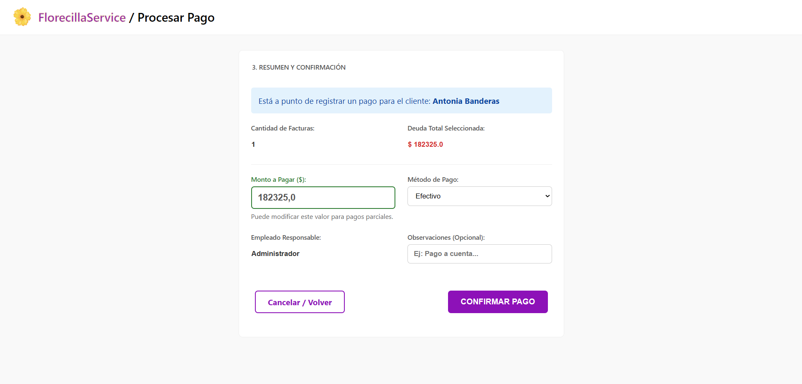

Aquí podrá procesar el pago. Primero, se le muestra un resumen previo a la confirmación, donde se muestran datos tales como a quién se le está procesando el pago, la cantidad de facturas a pagar y el total de la deuda seleccionada.

Luego, ustéd podrá ingresar el monto a pagar, que puede estar entre 0 y el total de la deuda seleccionada. (Observe que no se permiten saldos a favor por el momento, aunque si pagos parciales). Posteriormente debe seleccionar el método de pago y alguna observación (opcional). 
Debajo tiene dos botones, el botón **Cancelar/Volver**, que lo redirige a la pantalla de **Administrar pagos**, y el botón **Confirmar pago**, que registra el pago exitosamente, actualizando el estado de la factura según corresponda y generando un recibo de pago. 

Luego de pagar, el resumen del cliente se ve de la siguiente manera:
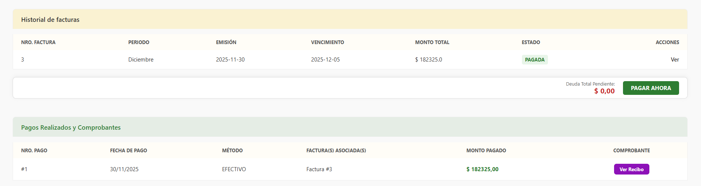

En donde se ve que el estado de la factura se modificó a pagado y la deuda total pendiente es `$ 0,00`. Asímismo, se observa en la tabla de *Pagos realizados y Comprobantes* el resumen del pago y la posibilidad de ver el recibo. [Ir a Recibo de Pago](#recibo-de-pago-total)

# Backlog de iteraciones

* HU 05 - Modificación de servicio
* HU 06 - Baja lógica de servicio
* HU 09 - Ver estado de cuenta del cliente
* HU 10 - Emisión de recibos de pago
* HU 11 - Anulación de factura
* HU 12 - Registrar pago total
* HU 13 - Registrar pago parcial
* HU 14 - Informe de historial de facturación masiva

# Tareas

###### **Ernst Milagros Shaiel**

###### **Menacho Natalia Agustina**
En esta iteración tenía la tarea de desarrollar la **HU 14 - Informe de historial de facturación masiva** y terminar la **HU 11 - Anulación de factura**.

Para el desarrollo de la **HU 14** tomé como base el log de facturación desarrollado en la primera iteración, donde se hicieron pequeñas modificaciones en el funcionamiento y se permitió al usuario poder ver estos registros de forma visual. También implementé filtros por periodo y fecha para que el usuario pueda encontrar los registros que busca de forma rápida y sencilla.

La **HU 11** ya se encontraba avanzada gracias al trabajo realizado en la primera iteración. Se realizaron algunos cambios en los controladores y en el manejo de la creación de las notas de crédito. También se enlazaron los controladores con la interfaz y se verificó que el usuario pueda anular una factura y que se cree una nota de crédito de forma automática tomando los mismos valores que la factura original.

Además me dediqué a hacer pruebas de las clases relacionadas a `Factura` y `NotaCredito` (en cuanto a modelo, servicio y controlador). Y también realicé pruebas para los controladores de las otras clases más importantes. Utilicé `Mockito` y funciones de `JUnit 5` para construirlas.

Finalmente también realicé pequeños aportes para ayudar a mis compañeros. Y corregí un par de errores en la implementación de la facturación que fueron detectados durante esta iteración. También hice un par de pequeñas mejoras y eliminé algunas líneas que no se usaban.

###### **Roko María Guillermina**

###### **Verón Juan Manuel**

